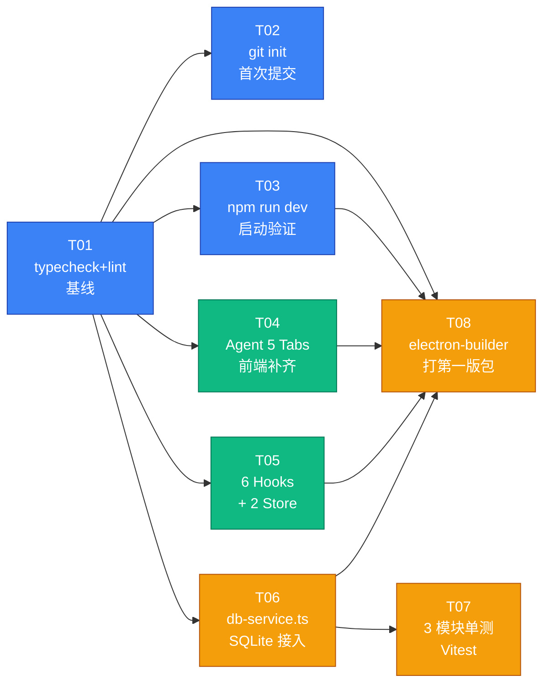

# ai-workstation 补齐任务架构规划

> 日期: 2026-06-03 · 作者: software-architect (Bob) · 范围: 8 个补齐任务的依赖图、文件清单、批次切分、共享知识、待确认项
> 项目根: `C:\Users\sq199\.qwenpaw\workspaces\default\coding_projects\1\ai-workstation\`

---

## 变更日志

| 版本 | 时间 | 变更 | 来源 |
|---|---|---|---|
| v1 | 2026-06-03 上午 | 首发:6 节齐全,8 任务图谱 + 27 文件清单 + 3 批次切分 | 架构师首版 |
| **v2** | **2026-06-03 下午** | **§3 T06 文件清单 + 改动量 + §3 T08 文件清单 + §4 C3 + §5.8(7 表 schema 详规) + §5.9(icon 自动生成) + §6 Q1/Q4/Q6 标记已拍板 + 附录B T08 风险 1 改写** | **岚拍板 3 项决策:Q1 用默认 5 Tab / Q4 扩 7 表 / Q6 禁占位、自动生成** |

---

## 1. 现状再核验

### 1.1 文件系统快照(2026-06-03 现场核对)

| 路径 | 状态 | 备注 |
|---|---|---|
| `.git/` | **不存在** | 上游假设"可能需保留"是误判 — 任务 #2 是全新 `git init`,无需保留任何东西 |
| `src/renderer/hooks/` | **空目录** | 任务 #5 所说的 6 个 hook 全部需要新增 |
| `src/renderer/stores/` | 3 个文件 | `agentStore.ts` / `chatStore.ts` / `settingsStore.ts` — 任务 #5 补 2 个 = 总 5 个 |
| `src/renderer/pages/` | 9 个 Page | 全部已存在,只是简单单组件,需要补 Tab/分区等深度 |
| `src/renderer/pages/Agents/AgentsPage.tsx` | 单卡片网格 | 无 Tab,需重构(任务 #4) |
| `src/renderer/components/` | 仅 `ModelSelector.tsx` + 空 `ui/` | 通用 UI 库待建 |
| `src/main/services/` | **7 个** | `agent/cron/eaa-bridge/keystore/pi-ai/settings/skill` (上游记成 6 个,实际 7) |
| `src/main/services/db-service.ts` | **不存在** | 任务 #6 全新建 |
| `src/main/ipc/` | 8 个 handler | 完整覆盖 `ipc-channels.ts` 全部 90+ 通道 |
| `src/shared/ipc-channels.ts` | 90+ 通道常量 | 按 `ai/agent/eaa/privacy/cron/skill/settings/sys` 分组 |
| `src/shared/types/index.ts` | 480+ 行类型 | 单一文件,涵盖全部域类型 |
| `*.test.ts` / `*.spec.ts` | 0 个项目内 | 任务 #7 从零起步 |
| `package.json` | scripts 完备 | 含 `dev/build/lint/lint:fix/test/typecheck/package/package:portable/package:installer` |
| `biome.json` | v2.3.5 | 单引号、无分号、2 空格、100 列宽 |
| `vite.config.main.ts` | CJS lib 双 entry | `index` + `preload`,external 含 electron/better-sqlite3/node-cron/chokidar/cross-spawn |
| `vite.config.renderer.ts` | SPA + HMR | port 5173 / strictPort,root=`src/renderer`,base=`./` |
| `electron-builder.yml` | Win NSIS+Portable | `asarUnpack: **/*.exe\|*.node\|*.dll`,icon 必须 `resources/icon.ico` |
| `tsconfig.json` | strict + 路径别名 | `@main/*` `@renderer/*` `@shared/*` |
| `docs/architecture/` | 空目录 | 本次规划首个产物落地处 |

### 1.2 关键现状发现

1. **上游情报的两处偏差**:
   - services 是 **7 个**不是 6 个(多了 `cron-service.ts`)
   - 任务 #2 "git init" 前**无 .git 目录**,全新初始化,不存在"保留或重建"的二选一
2. **db-service 尚未接入**意味着: 7 个 service 目前都跑在文件 / 内存 / Rust 子进程上,没有任何 SQLite 调用点;任务 #6 是**新增依赖注入入口**而非替换现有实现
3. **Hooks 目录完全空白**意味着: 现有 3 个 store 是被 Page **直接 import 调用的**(见 `AgentsPage.tsx` 第 6 行 `import { useAgentStore } from '../../stores/agentStore'`),没有"hook 层"封装 — 任务 #5 是**新引入一层**
4. **electron-builder 需要 `resources/icon.ico`** — 任务 #8 必须先确认该文件存在
5. **vitest 已装但无 vitest.config** — 任务 #7 需顺手补 `vitest.config.ts`(`environment: 'node'`,因单测对象是主进程 service)

---

## 2. 任务依赖图



**依赖说明**:
- T01 是所有任务的前置(typecheck/lint 不过,后续无法合入)
- T02 / T03 仅依赖 T01,可与 T04 / T05 并行
- T04 / T05 互相独立(不同的文件树),可并行
- T06 是 T07 的前置(db-service 没建,就没法测它);同时 T06 也是 T08 的弱前置(打包不依赖 db-service 的功能,但代码不干净会 lint 失败 → 实际被 T01 兜底)
- T08 在 T03 / T04 / T05 / T06 都完成后才能出"功能完整的"第一版包

---

## 3. 关键文件清单

> 路径以 `ai-workstation/` 为根。所有"新增"路径的父目录若不存在需顺手 `mkdir`。

### 任务文件映射

| 任务 | 操作 | 文件路径 | 说明 |
|---|---|---|---|
| **T01** typecheck+lint | 改 | `package.json` (无改,直接跑命令) | 跑 `npm run typecheck` + `npm run lint:fix`,产物: baseline 报告 |
| **T02** git init | 新建 | `.gitignore` | 必须先建 `.gitignore`(`node_modules/` `dist/` `release/` `*.log` `.DS_Store`)再 init |
| **T02** git init | 新建 | `.git/` | 跑 `git init` + `git add .` + `git commit -m "chore: initial baseline"` |
| **T03** dev 启动验证 | 改(可能) | `vite.config.main.ts` / `vite.config.renderer.ts` | 若 typecheck 通过但 dev 起不来再调;否则仅跑 `npm run dev` + 手工验证 |
| **T04** Agent 5 Tabs | 重构 | `src/renderer/pages/Agents/AgentsPage.tsx` | 改写为 Tab 容器 |
| **T04** Agent 5 Tabs | 新建 | `src/renderer/pages/Agents/tabs/OverviewTab.tsx` | 把现有 grid 逻辑搬过来 |
| **T04** Agent 5 Tabs | 新建 | `src/renderer/pages/Agents/tabs/SoulTab.tsx` | 调 `getAPI().agent.getSoul/setSoul`,读 Markdown |
| **T04** Agent 5 Tabs | 新建 | `src/renderer/pages/Agents/tabs/RulesTab.tsx` | 调 `getAPI().agent.getRules/setRules` |
| **T04** Agent 5 Tabs | 新建 | `src/renderer/pages/Agents/tabs/HistoryTab.tsx` | 调 `getAPI().agent.getHistory` + 表格(`@tanstack/react-table` 已装) |
| **T04** Agent 5 Tabs | 新建 | `src/renderer/pages/Agents/tabs/RunTab.tsx` | 调 `getAPI().agent.runManual` + textarea 提单 |
| **T05** 6 Hooks | 新建 | `src/renderer/hooks/useAgents.ts` | `useAgents()` 封装 agentStore + 加载态 |
| **T05** 6 Hooks | 新建 | `src/renderer/hooks/useChat.ts` | `useChat()` 封装 chatStore + 流式事件订阅 |
| **T05** 6 Hooks | 新建 | `src/renderer/hooks/useSettings.ts` | `useSettings()` 封装 settingsStore |
| **T05** 6 Hooks | 新建 | `src/renderer/hooks/useTheme.ts` | 主题切换(`dark/light/system`) |
| **T05** 6 Hooks | 新建 | `src/renderer/hooks/useKeyboardShortcuts.ts` | 全局快捷键(绑定到 `UnifiedSettings.shortcuts`) |
| **T05** 6 Hooks | 新建 | `src/renderer/hooks/useDebounce.ts` | 通用工具 hook |
| **T05** 2 Store | 新建 | `src/renderer/stores/uiStore.ts` | 全局 UI 状态(当前 Tab、侧栏折叠、活跃 Modal) |
| **T05** 2 Store | 新建 | `src/renderer/stores/notificationStore.ts` | Toast 队列 |
| **T05** 集成 | 改 | `src/renderer/pages/Agents/AgentsPage.tsx` + 现有 9 个 Page | 把直接 `import store` 改为走 hook 层(可分批) |
| **T06** db-service | 新建 | `src/main/services/db-service.ts` | `Database` 单例 + `init/migrations/crud`(7 表 + 1 系统表,详规见 §5.8) |
| **T06** db-service | 新建 | `src/main/services/migrations/001_initial.sql` | `_migrations` 系统表 + `agents` + `settings_cache` |
| **T06** db-service | 新建 | `src/main/services/migrations/002_cron.sql` | `cron_logs` 表 |
| **T06** db-service | 新建 | `src/main/services/migrations/003_chat.sql` | `chat_messages` 表 |
| **T06** db-service | 新建 | `src/main/services/migrations/004_eaa.sql` | `eaa_credentials` 表 |
| **T06** db-service | 新建 | `src/main/services/migrations/005_privacy.sql` | `privacy_policies` 表(密文+策略) |
| **T06** db-service | 新建 | `src/main/services/migrations/006_skins.sql` | `skins` 表 |
| **T06** db-service | 改 | `src/main/services/agent-service.ts` | 接入 `db-service` 做持久化(替换 JSON 文件) |
| **T06** db-service | 改 | `src/main/services/settings-service.ts` | 接入 db 缓存 |
| **T06** db-service | 改 | `src/main/services/cron-service.ts` | 写入 `cron_logs` |
| **T06** db-service | 改 | `src/main/services/eaa-bridge.ts` | 写入 `eaa_credentials` |
| **T06** db-service | 改 | `src/main/services/keystore-service.ts` | 为 `privacy_policies.encryptedPayload` 提供密钥派生 API(需确认已有/新建) |
| **T06** db-service | 改 | `src/main/index.ts` | 在 `app.whenReady` 调 `dbService.init()`(必须在 `registerAllHandlers` 之前) |
| **T07** 单测 | 新建 | `vitest.config.ts` | `test.environment: 'node'`,`include: src/**/*.test.ts` |
| **T07** 单测 | 新建 | `src/main/services/db-service.test.ts` | 内存 SQLite + **7 表全 CRUD 往返** + 迁移幂等性 + checksum 校验 |
| **T07** 单测 | 新建 | `src/main/services/agent-service.test.ts` | 加载 fixture + 启停/切换状态 |
| **T07** 单测 | 新建 | `src/main/services/pi-ai-service.test.ts` | Mock HTTP,验证重试/超时/流解析 |
| **T08** 打包 | Step 0 探测 | 全仓扫描 icon | `find` 扫 `resources/`、根目录、`public/` 三个位置 + `package.json.build.icon` + `electron-builder.yml` icon 字段;详规见 §5.9 |
| **T08** 打包 | Step 1 生成(若需) | `scripts/generate-icon.mjs` | 若未找到 `icon.ico`,从项目内真实 PNG/SVG 生成 256x256 真 ICO,提交到 git |
| **T08** 打包 | Step 2 打包 | 跑 `npm run package` | 产物: `release/AI Workstation-0.1.0-Setup.exe` + `AI Workstation-0.1.0-portable.exe` |

### 改动量估算(行数,粗)

| 任务 | 新增行 | 修改行 | 文件数 |
|---|---|---|---|
| T01 | 0 | 0 | 0 |
| T02 | ~30 | 0 | 2 |
| T03 | 0~20 | 0~30 | 0~2 |
| T04 | ~400 | ~40 | 6 |
| T05 | ~300 | ~50 | 8 |
| T06 | ~670 | ~120 | 13 |
| T07 | ~350 | 0 | 4 |
| T08 | 0 | 0 | 0 |
| **合计** | **~1750** | **~240** | **~35** |

---

## 4. 执行顺序 + 批次切分

### 批次 A — 基线(P0 阻塞,必须最先)

| 顺序 | 任务 | 命令/动作 | 通过标准 |
|---|---|---|---|
| A1 | T01 | `npm run typecheck` → 修错到 0 报错;`npm run lint:fix` → 0 error | `tsc --noEmit` 退出码 0;`biome check` 退出码 0 |
| A2 | T02 | 写 `.gitignore` → `git init` → `git add .` → `git commit -m "chore: initial baseline"` | `git log` 看到 1 个 commit;`git status` clean |
| A3 | T03 | `npm run dev` 双窗口启动,等 ~5s,确认渲染进程 5173 端口监听、主进程无 crash 日志 | 两个进程都持续运行,可手动 Ctrl+C |

**A1 / A2 / A3 内部顺序**: A1 → A2 → A3(因为 typecheck 不通过的话 A2 没必要提交;dev 起不来的话 A2 提交的 baseline 也不可信)

### 批次 B — 前端补齐(P1,依赖 A 全部通过)

| 顺序 | 任务 | 并行可行性 | 备注 |
|---|---|---|---|
| B1 | T04 Agent 5 Tabs | 可与 B2 并行 | 工程师 A 负责 |
| B2 | T05 Hooks + 2 Store | 可与 B1 并行 | 工程师 B 负责;最后一步是把 9 个 Page 切到 hook 层(可放 A3 后立刻做) |

**B1 + B2 完成后 gate**: `npm run typecheck` + `npm run lint:fix` 必须仍 0 错;`npm run dev` 渲染 Agent 5 个 Tab 切换无控制台错误。

### 批次 C — 集成 + 交付(P0,依赖 A+B 全部通过)

| 顺序 | 任务 | 前置 | 备注 |
|---|---|---|---|
| C1 | T06 db-service | T01 | 单独一个 PR,接好 `agent-service` / `settings-service`,主进程启动时 `dbService.init()` |
| C2 | T07 单测 | C1 | 选 3 模块: **db-service** / **agent-service** / **pi-ai-service** — 前两个有真实逻辑可测,pi-ai 测流解析/重试 |
| C3 | T08 打包 | A3 + B1 + B2 + C1 | **Step 0 资源探测** → **Step 1 必要时自动生成 icon**(详规见 §5.9) → **Step 2 `npm run package`** |

**C1 → C2 → C3 严格串行**(C1 改了 service 签名,C2 才能写对 mock;C2 不过的话,C3 打出来也没人敢用)。

---

## 5. 共享知识(给工程师)

### 5.1 TS 路径别名(已配,直接用)

```ts
// tsconfig.json
"@main/*"    -> src/main/*
"@renderer/*" -> src/renderer/*
"@shared/*"  -> src/shared/*

// vite.config.main.ts 同步配置 alias
// vite.config.renderer.ts 同步配置 alias
```

`biome.json` 不感知 alias,直接 `import x from '@shared/types'` 即可。

### 5.2 biome.json 要点

- **单引号** + **无分号** + 2 空格缩进 + 100 列宽
- `organizeImports: enabled` — 提交前会自动整理 import 顺序
- `noExplicitAny: warn` — 业务代码出现 `any` 会告警(测试代码可放行)
- 跑 `npm run lint:fix` 自动格式化,只报错的才需要手改

### 5.3 vite 双入口要点

- `vite.config.main.ts`:
  - `outDir: dist/main` / `formats: ['cjs']`
  - lib 双 entry:**`index` (主进程入口) + `preload` (preload 脚本)**
  - `target: node22`
  - external:**`electron` / `better-sqlite3` / `node-cron` / `chokidar` / `cross-spawn`**(新增 native dep 时必须加入,否则打包找不到 .node)
  - **不 minify**,开启 sourcemap
- `vite.config.renderer.ts`:
  - `root: src/renderer` / `base: './'` / **port 5173 strictPort**(改端口要双侧同步)
  - `target: chrome130`
  - SPA 入口 `src/renderer/index.html`

### 5.4 electron-builder asarUnpack

```yaml
asar: true
asarUnpack:
  - "**/*.exe"     # EAA Rust 二进制
  - "**/*.node"    # better-sqlite3 等 native binding
  - "**/*.dll"
```

- 新增任何 native dep 后,**必须确认它在 unpack 后能正常加载**(`require('better-sqlite3')` 等会走 unpack 路径)
- `resources/icon.ico` **必须存在**,否则 `npm run package` 失败

### 5.5 IPC 通道命名约定

来源:`src/shared/ipc-channels.ts`

- 格式:`<域>:<动词-名词>`,全小写、`-` 分隔
- 8 个域:`ai` / `agent` / `eaa` / `privacy` / `cron` / `skill` / `settings` / `sys`
- 推/拉分两类:
  - 拉取式(`agent:list`): 一次返回
  - 订阅式(`agent:status-update` / `ai:chat-stream` / `cron:status-update`): 主进程 `webContents.send` 推送
- **约定**:
  - 渲染端访问统一走 `getAPI().<域>.<方法>(...)`(见 `src/renderer/lib/ipc-client.ts`)
  - 新增通道时**先在 `ipc-channels.ts` 加常量**,**再在 `ipc-client.ts` 的 `WindowAPI` 接口加类型**,最后才在 handler 里实现
  - 流式事件(`ai:chat-stream` 等)必须返回**取消订阅函数**:`onXxx(cb) => () => void`

### 5.6 Vitest 起步约定(任务 #7)

- 装包:已装 `vitest@^3.2.4`,**未装** `@vitest/coverage-v8`(先不引入覆盖率,等 8 个任务跑顺再加)
- `vitest.config.ts` 推荐:
  ```ts
  import { defineConfig } from 'vitest/config'
  export default defineConfig({
    test: {
      environment: 'node',  // 单测主进程 service
      include: ['src/**/*.test.ts'],
      globals: false,        // 显式 import {describe, it, expect}
    },
    resolve: {
      alias: {
        '@main': new URL('./src/main', import.meta.url).pathname,
        '@shared': new URL('./src/shared', import.meta.url).pathname,
      },
    },
  })
  ```
- 测试 DB 用 `better-sqlite3(':memory:')`,不要落盘
- Mock HTTP 用 `vi.spyOn(globalThis, 'fetch')` 或 `nock`(不引入新依赖,先 vi 顶)

### 5.7 db-service.ts 接入约定(任务 #6)

- 文件:`src/main/services/db-service.ts`
- 单例 + 懒初始化:`export const dbService = { init, get, all, run, transaction }`
- DB 路径:从 `UnifiedSettings.general.dataDir` 拼 `workstation.db`
- 首次启动:跑 `migrations/` 目录下所有 `.sql`(按文件名排序,记录到 `_migrations` 表)
- 主进程启动顺序:`app.whenReady()` → **`await dbService.init()`** → `registerAllHandlers(win)`(否则 handler 里访问 db 会 NPE)
- 写并发:用 `better-sqlite3` 的 `transaction()` 包裹,SQLite 单写者天然安全

### 5.8 db-service.ts 7 表 schema 详规(任务 #6 扩展版)

> 岚拍板"完整 7 表一次到位",本节替代 §5.7 中"4 表"默认表述。**7 张业务表 + 1 张 `_migrations` 系统表**,分布于 6 个迁移文件(`001_initial.sql` ~ `006_skins.sql`)。

#### 5.8.1 表清单(7 业务表 + 1 系统表)

**1. `agents`** — Agent 配置持久化(替换现有 JSON 文件存储)
- 主键:`id TEXT PRIMARY KEY`
- 列:`name TEXT NOT NULL` / `displayName TEXT` / `provider TEXT NOT NULL` / `model TEXT NOT NULL` / `temperature REAL DEFAULT 0.7` / `maxTokens INTEGER DEFAULT 2048` / `soulContent TEXT` / `rulesContent TEXT` / `enabled INTEGER NOT NULL DEFAULT 1` / `createdAt INTEGER NOT NULL` / `updatedAt INTEGER NOT NULL` / `cronExpr TEXT` / `lastRunAt INTEGER` / `nextRunAt INTEGER`
- 索引:`idx_agents_enabled` (`enabled`) / `idx_agents_nextRun` (`nextRunAt` WHERE enabled = 1)

**2. `cron_logs`** — 定时任务执行流水
- 主键:`id TEXT PRIMARY KEY` (UUID)
- 列:`agentId TEXT NOT NULL REFERENCES agents(id) ON DELETE CASCADE` / `triggerType TEXT NOT NULL CHECK(triggerType IN ('cron','manual','event'))` / `startedAt INTEGER NOT NULL` / `finishedAt INTEGER` / `durationMs INTEGER` / `status TEXT NOT NULL CHECK(status IN ('success','error','timeout','running'))` / `prompt TEXT` / `output TEXT` / `errorMessage TEXT` / `tokenUsageJson TEXT` / `cost REAL`
- 索引:`idx_cron_agent_started` (`agentId`, `startedAt` DESC) / `idx_cron_status` (`status`)

**3. `chat_messages`** — 聊天历史(渲染端分页拉取)
- 主键:`id TEXT PRIMARY KEY` (UUID)
- 列:`sessionId TEXT NOT NULL` / `agentId TEXT REFERENCES agents(id) ON DELETE SET NULL` / `role TEXT NOT NULL CHECK(role IN ('user','assistant','system','tool'))` / `content TEXT NOT NULL` / `tokenCount INTEGER` / `createdAt INTEGER NOT NULL` / `metadataJson TEXT`
- 索引:`idx_chat_session_created` (`sessionId`, `createdAt` DESC) / `idx_chat_agent` (`agentId`)

**4. `settings_cache`** — 设置项 KV 缓存(主存仍是 settings.json,DB 仅作快速读缓存)
- 主键:`key TEXT PRIMARY KEY`
- 列:`valueJson TEXT NOT NULL` / `schemaVersion INTEGER NOT NULL DEFAULT 1` / `updatedAt INTEGER NOT NULL`

**5. `eaa_credentials`** — EAA 桥接凭证索引(密文存磁盘,DB 仅存引用索引)
- 主键:`id TEXT PRIMARY KEY` (UUID)
- 列:`provider TEXT NOT NULL` / `accountLabel TEXT NOT NULL` / `ciphertextRef TEXT NOT NULL` / `keyVersion INTEGER NOT NULL DEFAULT 1` / `createdAt INTEGER NOT NULL` / `lastUsedAt INTEGER` / `revokedAt INTEGER`
- 索引:`idx_eaa_provider` (`provider`) / `idx_eaa_revoked` (`revokedAt`)

**6. `privacy_policies`** — 隐私策略(加密字段 + 策略版本)
- 主键:`id TEXT PRIMARY KEY` (UUID)
- 列:`scope TEXT NOT NULL CHECK(scope IN ('global','agent','domain'))` / `scopeRef TEXT` / `rulesJson TEXT NOT NULL` (含 redaction 规则、保留期、允许域) / `encryptedPayload BLOB` / `keyVersion INTEGER NOT NULL DEFAULT 1` / `enabled INTEGER NOT NULL DEFAULT 1` / `createdAt INTEGER NOT NULL` / `updatedAt INTEGER NOT NULL`
- 索引:`idx_privacy_scope_ref` (`scope`, `scopeRef`)

**7. `skins`** — 主题 / Skin 配置
- 主键:`id TEXT PRIMARY KEY` (UUID)
- 列:`name TEXT NOT NULL UNIQUE` / `displayName TEXT NOT NULL` / `author TEXT` / `version TEXT NOT NULL DEFAULT '1.0.0'` / `tokensJson TEXT NOT NULL` (颜色、间距、字体等 CSS 变量) / `previewImageRef TEXT` / `isBuiltin INTEGER NOT NULL DEFAULT 0` / `createdAt INTEGER NOT NULL`
- 索引:`idx_skins_builtin` (`isBuiltin`)

**8. `_migrations`** — 系统表(自动建)
- 主键:`version INTEGER PRIMARY KEY`
- 列:`filename TEXT NOT NULL` / `appliedAt INTEGER NOT NULL` / `checksum TEXT NOT NULL`

#### 5.8.2 迁移文件分布

| 文件 | 包含表 | 备注 |
|---|---|---|
| `001_initial.sql` | `_migrations` + `agents` + `settings_cache` | 一次性建系统表 + 核心配置 |
| `002_cron.sql` | `cron_logs` | 任务日志 |
| `003_chat.sql` | `chat_messages` | 聊天历史 |
| `004_eaa.sql` | `eaa_credentials` | EAA 凭证索引 |
| `005_privacy.sql` | `privacy_policies` | 隐私策略 + 密文 |
| `006_skins.sql` | `skins` | 主题表 |

#### 5.8.3 工期/风险重估(相对 §3 改动量原估)

- **行数**: SQL `~350 行`(6 文件平均 50 行/表) + TS `~200 行`(db-service.ts 7 表 CRUD + migration runner) + service 改造 `~120 行` → 合计 **~670 行**(原估 ~250,**+168%**)
- **新增文件**: `002~006` 五个 SQL + 1 个 keystore 改造 + 1 个 cron-service 改造 + 1 个 eaa-bridge 改造 = **T06 文件数 5 → 13**
- **风险升级**:
  1. `eaa_credentials.ciphertextRef` 与 `privacy_policies.encryptedPayload` 都依赖 **keystore-service** 派生的密钥;db-service 不知道密钥,只能存密文 + keyVersion。**必须先确认 keystore-service 提供的 API**,若没有要新建
  2. `agents` 表引入后**老数据迁移**问题(现有 `config/agents/*.json` 文件)风险回归 — 建议加 `001b_seed_agents.sql` 把已有 JSON 一次性导入
  3. `cron_logs` 写并发高(`node-cron` 每分钟可能多次 INSERT),**必须 `transaction()` 包裹**,否则 `SQLITE_BUSY` 概率上升
  4. 7 表全开 → `db-service.init()` 时间从 ~50ms 可能涨到 ~200ms(纯 SQLite 操作,可接受)

#### 5.8.4 对 T07 单测的影响(3 模块够不够?)

**保持 3 模块**(db-service / agent-service / pi-ai-service),但 **db-service.test.ts 必须扩展覆盖**:
- 7 张表**全部 CRUD 往返**(每表至少 1 个 INSERT + SELECT + UPDATE + DELETE)
- 迁移 runner 的**幂等性**(跑两遍不报错)
- `_migrations` 表的 checksum 校验(改一个 SQL 文件的字符,再次启动应提示)
- `agents` 的 `ON DELETE CASCADE` 行为(删一个 agent,对应的 `cron_logs` 自动清掉)
- `chat_messages` 的分页拉取(`LIMIT/OFFSET` 或 keyset pagination)

**不新增 EAA / Privacy 加密单测**(理由:这两个表的密文由 keystore 派生,加测要 mock `node:crypto` + keystore,工时翻倍;延到下一批)。

#### 5.8.5 db-service.ts API 形态(推荐)

```ts
export const dbService = {
  init(): Promise<void>           // 跑所有 migrations(幂等)
  close(): void
  // 通用 API(起步就用)
  get<T>(sql: string, ...params: unknown[]): T | undefined
  all<T>(sql: string, ...params: unknown[]): T[]
  run(sql: string, ...params: unknown[]): { lastInsertRowid: number | bigint; changes: number }
  transaction<T>(fn: () => T): T
  // 7 表专用 repository(可选 — **建议放迭代二**,首版避免过度设计)
  // agents: AgentsRepo; cronLogs: CronLogsRepo; ...
}
```

> **建议**: 起步只暴露通用 API,Repository 层放迭代二。工程师不要在 T06 期间造 7 个 Repo 类,先把 6 个 SQL 文件 + migration runner 落地。

### 5.9 T08 icon 资源探测 + 自动生成流程(任务 #8)

> 岚拍板"自己找自己看,不能占位,必须全部完成"。**❌ 禁止使用 16x16 单色占位 ICO**;若未找到现成 icon,必须从项目内真实图片资源生成 256x256 真 ICO,并把生成脚本提交到 git。

#### 5.9.1 Step 0 — 资源探测(必跑,5 分钟)

依次执行,记录每个候选到 `docs/architecture/icon-scan-2026-06-03.md`:

```bash
# 1. 全仓扫(排除 node_modules / dist / release)
find . -path ./node_modules -prune -o -path ./dist -prune -o -path ./release -prune \
  -o -type f \( -name "icon.ico" -o -name "icon.png" -o -name "favicon.ico" \
            -o -name "favicon.png" -o -name "logo.*" -o -name "app-icon.*" \) -print

# 2. 重点位置逐一确认
ls -la resources/
ls -la public/ 2>/dev/null || echo "public/ 不存在"
ls -la src/renderer/assets/ 2>/dev/null || echo "src/renderer/assets/ 不存在"

# 3. 检查 package.json.build.icon 字段
node -e "const p = require('./package.json'); console.log('build.icon =', p.build?.icon ?? '未配置')"

# 4. 检查 electron-builder.yml
grep -n "icon:" electron-builder.yml
```

**判定逻辑**:
- 找到 `*.ico` → Step 1 跳过,直接复制到 `resources/icon.ico`(若路径不一致)
- 找到 `*.png` (≥256x256) → Step 1 用 `png-to-ico` 转
- 找到 `*.svg` → Step 1 先 `sharp` 栅格化,再 `png-to-ico` 转
- 找到 `<256` 的小图 → Step 1 拉大到 256x256
- 全部没找到 → Step 1 fallback:从 `src/renderer/assets/` 最大的 PNG / SVG 走流程
- **如果连一张可用的 PNG/SVG 都没有** → 再次 fallback:挑项目内 `README.md` 引用的任意图片(配图、demo 截图、avatar 等),仍没有则本次打包**失败并报告**,不得编造

#### 5.9.2 Step 1 — 自动生成(若需)

新增 `scripts/generate-icon.mjs`,**提交到 git**:

```js
#!/usr/bin/env node
// 用法: node scripts/generate-icon.mjs <source.png|svg> <output.ico>
// 依赖: sharp(可能已装)/ png-to-ico(需装) — 见 §5.9.3
import sharp from 'sharp'
import pngToIco from 'png-to-ico'
import { readFileSync, writeFileSync } from 'node:fs'

const [, , src, out] = process.argv
if (!src || !out) {
  console.error('用法: node scripts/generate-icon.mjs <source.png|svg> <output.ico>')
  process.exit(1)
}

const isSvg = src.endsWith('.svg')
const pngBuf = isSvg
  ? await sharp(readFileSync(src))
      .resize(256, 256, { fit: 'contain', background: { r: 0, g: 0, b: 0, alpha: 0 } })
      .png()
      .toBuffer()
  : await sharp(readFileSync(src))
      .resize(256, 256, { fit: 'cover' })
      .png()
      .toBuffer()

const icoBuf = await pngToIco(pngBuf)
writeFileSync(out, icoBuf)
console.log(`✓ 生成 ${out} (${icoBuf.length} bytes, 256x256, 来自 ${src})`)
```

**输出位置固定**:`resources/icon.ico`(electron-builder.yml 期望的路径)。

#### 5.9.3 依赖(若未装)

```bash
npm install -D sharp png-to-ico
```

- `sharp@^0.34` — 跨平台栅格化库,Windows 下需下载原生二进制,体积大但稳定
- `png-to-ico@^2.1` — 纯 JS,无 native 依赖,小

**fallback 链**:若 `sharp` 装不上(Windows native 编译失败),改用 `@resvg/resvg-js`(纯 wasm)做 SVG → PNG,再 `png-to-ico` 转。

#### 5.9.4 Step 2 — 打包

```bash
npm run package
```

**产物**:
- `release/AI Workstation-0.1.0-Setup.exe`(NSIS 安装器)
- `release/AI Workstation-0.1.0-portable.exe`(Portable 版)

#### 5.9.5 验收清单(工程师自检)

- [ ] `resources/icon.ico` 存在且 ≥ 10KB(256x256 真图标,**非 16x16 单色占位**)
- [ ] `file resources/icon.ico` 输出含 `MS Windows icon resource`
- [ ] `npm run package` 退出码 0
- [ ] `release/` 目录出现两个 .exe
- [ ] 双击 `*-portable.exe` 能启动应用,标题栏 / 任务栏图标正确显示
- [ ] `scripts/generate-icon.mjs` 已提交到 git(若 Step 1 跑了)

---

## 6. 待确认问题(开放项)

> 标 **[需要岚拍板]** 的是必须确认的;标 **[默认 X · 待回执]** 的是我已经给出推荐方案的。

### Q1. ✅ **已拍板** 5 个 Agent Tab 命名

岚拍板采用默认方案:**Overview / Soul / Rules / History / Manual Run**(覆盖全部 6 条 `IPC_AGENT_*` 通道)。
- §3 T04 文件清单无需调整
- 工程师可按 §3 表格直接落地

### Q2. **[默认 6 个新 hook · 待回执]** 6 个 hook 的具体清单

我的推荐:
1. `useAgents()` — 封装 `agentStore`,返回 `{ agents, loading, fetchAgents, toggle }`
2. `useChat()` — 封装 `chatStore` + `ai.onStream` 订阅
3. `useSettings()` — 封装 `settingsStore`,返回 `{ settings, update, reset }`
4. `useTheme()` — 主题切换(读 `settings.general.theme`,落地到 `document.documentElement.classList`)
5. `useKeyboardShortcuts()` — 全局快捷键(读 `settings.shortcuts`)
6. `useDebounce<T>(value, ms)` — 通用工具(给搜索框等用)

**如果岚有更具体的清单请回执,否则按此执行。**

### Q3. **[默认 2 个新 store · 待回执]** 2 个新 store 的具体清单

我的推荐:
1. `uiStore.ts` — `{ activeTab, sidebarCollapsed, openModal, setActiveTab, toggleSidebar, closeModal }`
2. `notificationStore.ts` — `{ toasts, pushToast, dismissToast }`(全局 toast 队列)

**候选替代**:`cronStore.ts` + `privacyStore.ts`(给 Scheduler / Privacy 页面解耦),好处是"按域补 store"语义更清晰;坏处是这俩页面目前已经直接调 IPC,加了 store 多一层。
**默认执行 `uiStore` + `notificationStore`**,跨页面影响最大、收益最高。

### Q4. ✅ **已拍板** db-service schema 范围(扩为 7 表)

岚拍板 **"完整 7 表一次到位"**(不是 4 表最小集)。**7 表 schema 详规见 §5.8**:
- 核心 4 表:`agents` / `cron_logs` / `chat_messages` / `settings_cache`
- 扩展 3 表:`eaa_credentials` / `privacy_policies` / `skins`
- 工期从 ~250 行上调至 **~670 行**,6 个 SQL 文件(001~006),T06 涉及 13 个文件
- 风险点 & keystore 依赖见 §5.8.3;对 T07 单测的影响见 §5.8.4

### Q5. **[需要岚拍板]** 3 个单测模块的最终选择

我的推荐:**db-service + agent-service + pi-ai-service**。
- `db-service` — 真有逻辑(SQL 建表、CRUD、迁移)
- `agent-service` — 加载/启停状态机,有分支可测
- `pi-ai-service` — 流式解析 + 重试 + 超时,Mock HTTP 后纯函数测试
- 不推荐 `eaa-bridge`(依赖 Rust 子进程,得 mock child_process,收益低)
- 不推荐 `cron-service`(强依赖 `node-cron` 时间,需 fake timers)

**如果岚想换成"全 service 跑通"模式请回执,否则按 3 个执行。**

### Q6. ✅ **已拍板** icon 处理策略(禁止占位,自动生成)

岚拍板 **"自己找自己看,不能占位,必须全部完成"**。**详规见 §5.9**,核心策略:
- **Step 0**: 全仓 `find` 扫 `resources/`、根目录、`public/` 三个位置 + 同步检查 `package.json.build.icon` + `electron-builder.yml` icon 字段
- **Step 1**(若需): 从项目内任意 **真 PNG** 或 **SVG**(用 `sharp` 栅格化)生成 256x256 真 ICO,提交 `scripts/generate-icon.mjs`
- ❌ **禁止**使用 16x16 单色占位 ICO
- 兜底链:sharp 装不上 → 换 `@resvg/resvg-js`(wasm);整仓无图 → **打包失败并报告,不得编造**

### Q7. **[默认 3 工程师并行 · 待回执]** 人力分配建议

| 工程师 | 任务 | 备注 |
|---|---|---|
| Eng-A | T01 → T02 → T03 → T04 → T08 | 前端主担当,贯穿基线到打包 |
| Eng-B | T01(并行)→ T05 → T08 | 前端 hooks/store 主担当 |
| Eng-C | T01(并行)→ T06 → T07 → T08 | 后端 db-service + 单测主担当 |

3 人全部从 T01 起步(修 typecheck 错时各人领一片),T03 之后 T04 / T05 / T06 真正并行。
**如果岚人力不足 3 人**,则 T04 与 T05 串行(同一个人),C 阶段全归一人。

### Q8. **[需要岚拍板]** 是否需要"先 Freeze UI"基线截图

任务 #4 之前,建议先 `npm run dev` 截 9 个 Page 当前状态的基线图,存到 `docs/architecture/screenshots/baseline-2026-06-03/`。
- 后续 T04 / T05 改完可对比"是否引入视觉回归"
- 成本 ~5 分钟

**默认建议做**,如果岚赶时间可跳过。

---

## 附录 A: 关键类型签名速查(摘自 `src/shared/types/index.ts`)

```ts
// Agent 5 Tab 用到的核心类型
export interface AgentListItem extends AgentConfig {
  status: AgentStatus       // 'idle' | 'running' | 'error'
  lastRunAt?: number
  nextRunAt?: number
}
export interface AgentDetail extends AgentListItem {
  soulContent: string       // Soul Tab 编辑用
  rulesContent: string      // Rules Tab 编辑用
  executionHistory: AgentExecution[]   // History Tab 用
}
export interface AgentExecution {
  id: string
  agentId: string
  prompt: string
  output: string
  startedAt: number
  durationMs: number
  tokenUsage: TokenUsage
  cost: number
  status: 'success' | 'error' | 'timeout'
}
```

## 附录 B: 风险点(每任务 ≤ 3 个)

| 任务 | 风险 1 | 风险 2 | 风险 3 |
|---|---|---|---|
| T01 | 现存代码用了未声明的变量/导入,需补齐 | biome 对老代码可能大面积格式化 | 修了类型后某些 IPC 调用签名要变,牵动下游 |
| T02 | `.gitignore` 漏了 `release/` 会把二进制包提交 | 首 commit 体量可能过大(无 `dist/` 过滤) | — |
| T03 | `better-sqlite3` native 编译在 Windows 可能失败 | 5173 端口被占 | 渲染进程的 React Router 初始化时机可能晚于 IPC 调用 |
| T04 | 5 Tab 同时挂载会触发 5 次 IPC 拉取,需做缓存或按需加载 | Soul/Rules 需 Markdown 编辑器,要不要引新依赖(已装 `react-markdown` 只读,没编辑器) | History 数据量大时表格性能(`@tanstack/react-table` 已装可虚拟化) |
| T05 | Hook 层加在 store 与 Page 之间,9 个 Page 全要改,容易漏 | 主题切换触发整个 React tree 重渲染,需 `useMemo` | 快捷键 hook 在 Electron 环境下与系统快捷键冲突 |
| T06 | 首次接入会替换现有 JSON 持久化,**老数据迁移**要不要做 | `better-sqlite3` 在 Windows 打包时缺 .node,需确认 `asarUnpack` 覆盖 | 主进程多 handler 并发写需 `transaction` 包装 |
| T07 | `pi-ai-service` 的流式解析可能用了 Buffer/Web Streams,Node 环境测试需要 polyfill | mock 时间 / fetch 时容易泄漏全局 | — |
| T08 | icon 资源扫描失败(全仓无 PNG/SVG) 或 sharp 在 Windows 装不上需改 resvg-js fallback | NSIS 安装包需代码签名(否则 Windows Defender 警告) | `extraResources` 里 `eaa-binaries/` 若缺失会静默成功但运行时报错 |

---

> **报告人**: software-architect (Bob)
> **回传**: team-lead via SendMessage
> **保存位置**: `docs/architecture/supplement-task-plan-2026-06-03.md`
